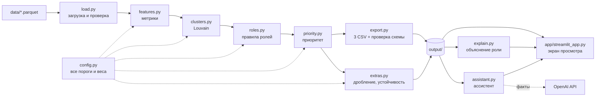
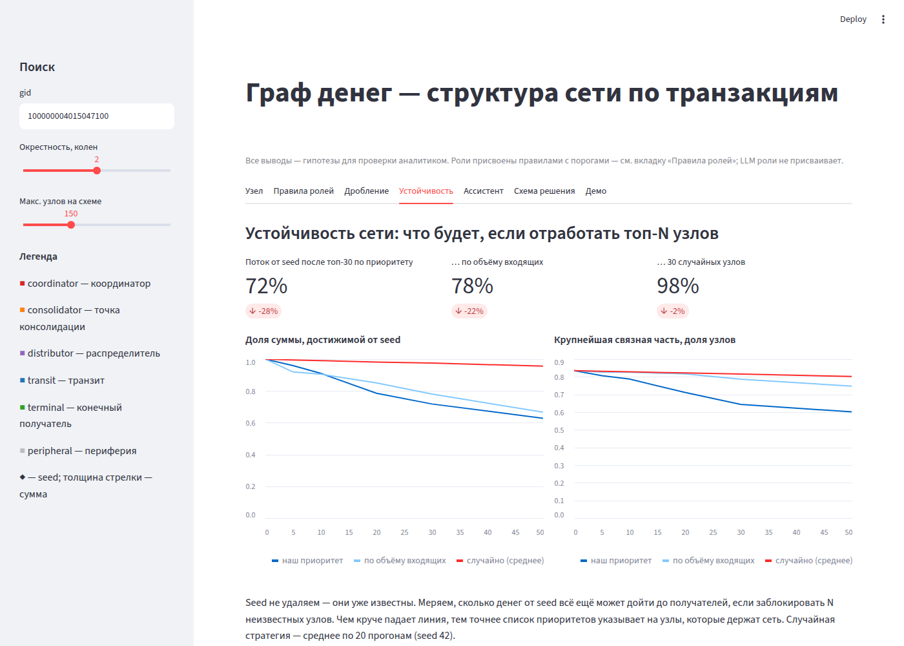

# Граф денег — восстановление структуры финансовой сети по транзакциям

Решение кейса «Граф денег» хакатона HackAlem AI (трек Freedom, AML).


## Содержание

1. [Краткое описание](#краткое-описание)
2. [Что реализовано](#что-реализовано)
3. [Как работает решение](#как-работает-решение)
4. [Технологии](#технологии)
5. [Архитектура](#архитектура)
6. [Установка и запуск](#установка-и-запуск)
7. [Как проверить решение](#как-проверить-решение)
8. [Данные и интеграции](#данные-и-интеграции)
9. [Роли: правила и пороги](#роли-правила-и-пороги)
10. [Соответствие ТЗ](#соответствие-тз)
11. [Ограничения](#ограничения)
12. [Масштабирование до ~1 млн узлов](#масштабирование-до-1-млн-узлов)
13. [Deployed-версия](#deployed-версия)

## Краткое описание

**Проблема.** AML-аналитику банка по оперативной информации известен только нижний уровень цепочки — 81 клиент, получавший деньги, связанные с незаконным оборотом наркотиков. Кто собирает эти деньги, через кого их прогоняют и кто ими распоряжается, приходится восстанавливать вручную, переход за переходом, по сети из 2 248 клиентов.

**Для кого.** AML-аналитик, специалист подразделения финансового мониторинга банка.

**Что даёт инструмент.** По выгрузке переводов на 4 колена от известных клиентов он присваивает каждому из 2 248 узлов объяснимую роль, делит сеть на кластеры и отвечает на вопрос **«кого смотреть первым и почему»**: ранжированный список с текстовым обоснованием по каждому узлу.

Все выводы — **гипотезы для проверки аналитиком** («признаки консолидации»), а не утверждения о виновности.

## Что реализовано

**Пайплайн (одна команда, ≈4 с на выданных данных):**

- **Роль у каждого узла** — координатор, точка консолидации, распределитель, транзит, конечный получатель, периферия. Роль присваивается правилами с порогами. У каждой роли есть оценка уверенности 0–1 и текстовое обоснование на основе чисел (evidence, до 200 символов).
- **Кластеры** — 106 групп (алгоритм Louvain). По каждой: размер, число seed, внутренний оборот, топ-5 узлов и гипотеза о назначении («признаки сбора средств с 4 seed в точку консолидации …»).
- **Приоритет** 0–1 и топ-30 узлов с пояснением, за что узел поднят в списке.
- **Учёт ловушек данных:** 444 узла, обрезанных 4-м коленом, никогда не считаются конечными получателями, но различаются по профилю входящих: 33 из них похожи на конечных получателей, и для них рекомендуется запросить 5-е колено (см. [ниже](#обрезанные-4-м-коленом-как-различаем)). У seed не используется доля пропуска, потому что их входящие занижены выгрузкой.
- **Временные признаки:** скорость пересылки (какая доля ушла в течение 2 дней после прихода), лаг между приходом и уходом, всплески переводов за день.
- **Признаки дробления** (`output/bursts.csv`): 93 случая «≥ 3 перевода одной паре за день» и 29 случаев «≥ 4 разных плательщика одному получателю за день».
- **Устойчивость сети** (`output/resilience.csv`): сколько денег от seed ещё может дойти до получателей, если заблокировать N узлов. После удаления 30 узлов остаётся:

  | Кого удаляем (30 узлов) | Доля потока от seed |
  |---|---|
  | топ по нашему приоритету | 72 % |
  | топ по объёму входящих | 78 % |
  | случайные (среднее по 20 прогонам) | 98 % |

- **Объяснение роли за минуту:** `python -m moneygraph explain <gid>` — правило, факты, метрики, крупнейшие плательщики и получатели.

**Экран просмотра (Streamlit), 7 вкладок:**

| Вкладка | Что показывает |
|---|---|
| Узел | поиск по gid, карточка роли, объяснение, схема окрестности со стрелками по направлению денег (цвет узлов — по роли или по кластеру), входящие и исходящие переводы, топ-лист, кластеры |
| Правила ролей | таблица правил и порогов (строится из `config.py`), число узлов и пример на каждую роль, формула приоритета |
| Дробление | эпизоды из `bursts.csv` с фильтром по типу |
| Устойчивость | графики из `resilience.csv`: три стратегии удаления узлов |
| Ассистент | вопрос с gid → общие получатели и плательщики → ответ со ссылками на gid |
| Схема решения | данные → метрики → роли → кластеры → интерфейс, с числами из прогона |
| Демо | сценарий на 5 минут с реальными gid, чек-лист репетиции, ответы на вероятные вопросы |

**AI-ассистент аналитика.** На вопрос вида «кто собирает деньги с этих пятерых: <gid> …» код обходит граф до 2 колен и находит общих получателей и общих плательщиков. Модель OpenAI только пересказывает эти факты и роли не присваивает. Без ключа, без интернета или при ошибке API ответ собирается по шаблону из тех же фактов. Источник ответа подписан под ним.

**Офлайн-запуск без установки Python:** архивы с портативным Python для Windows и Linux (см. [Установка и запуск](#установка-и-запуск)).

## Как работает решение

Основной сценарий аналитика — от входных данных до результата:

1. **Вход.** Три файла `.parquet` из выгрузки: пары «плательщик → получатель», узлы с признаком seed и отдельные транзакции.
2. **Прогон.** `python -m moneygraph run` строит направленный граф и считает метрики узлов: степени, суммы, долю пропуска (сколько отдал от полученного), посредничество (betweenness), PageRank, скорость пересылки, циклы.
3. **Кластеры.** Louvain делит сеть на группы.
4. **Роли.** Правила применяются по порядку, первое сработавшее задаёт роль. Evidence пишется из тех же чисел, по которым сработало правило.
5. **Приоритет.** Взвешенная сумма рангов; обрезанные узлы и seed штрафуются.
6. **Выход.** `nodes_roles.csv`, `clusters.csv`, `top_nodes.csv` в схеме ТЗ, плюс `bursts.csv` и `resilience.csv`. Встроенная проверка схемы останавливает прогон, если файл не соответствует ТЗ.
7. **Работа аналитика.** Аналитик открывает экран, берёт узел из топ-листа, видит схему связей и обоснование роли, проверяет признаки дробления и задаёт вопрос ассистенту. Итог — перечень клиентов на углублённую проверку.

Пример обоснования для узла №1 в топ-листе (`explain 100000004015047100`):

```
gid 100000004015047100: роль — ТОЧКА КОНСОЛИДАЦИИ, уверенность 0.92, приоритет 1.00, кластер 5
Правило: in_deg≥4 и пропуск<30% (или ≥2 seed-плательщиков и пропуск<50%)
Факты: получает от 9 плательщиков (919,104 KZT, из них 3 seed), отдаёт дальше 8%
```

## Технологии

| Слой | Что используется |
|---|---|
| Язык | Python (проверено на 3.11) |
| Данные | pandas, pyarrow (чтение parquet), numpy |
| Графы | networkx: PageRank, betweenness, HITS, простые циклы до 5 шагов, Louvain; scipy — зависимость networkx для PageRank |
| Интерфейс | Streamlit; pyvis — схема сети на vis.js, библиотека встроена в страницу, CDN не нужен |
| AI | OpenAI API через пакет `openai` (Chat Completions), модель `gpt-5-mini` — задаётся в `config.py` или переменной `OPENAI_MODEL` |
| Тесты | pytest, 7 тестов |
| Офлайн-сборка | [python-build-standalone](https://github.com/astral-sh/python-build-standalone) 3.11.11, скрипты bash / cmd / PowerShell |

GPU, облачный кластер и обучение моделей не нужны. Интернет нужен только ассистенту для запроса к OpenAI.

## Архитектура



- **Пайплайн** (`moneygraph/`): `load → features → clusters → roles → priority → export → extras`, оркестрация в `pipeline.py`, команды — в `cli.py`.
- **Все пороги и веса** — только в `moneygraph/config.py`; gid в коде не зашиты.
- **Экран, `explain` и ассистент** только читают `output/` и `data/`, ничего не пересчитывают. Поэтому экран всегда показывает ровно то, что лежит в CSV.
- **LLM** подключается только в ассистенте и получает уже готовые факты. Роли, кластеры и приоритеты считаются без LLM, детерминированно (фиксированный seed Louvain).

Структура репозитория:

```
moneygraph/          пайплайн, explain, assistant, cli; config.py — все пороги
app/                 streamlit_app.py — экран просмотра
tests/               test_outputs.py — проверки must-have, дробления, устойчивости, ассистента
data/                parquet от организаторов
output/              результат прогона (CSV в репозитории; features.parquet создаётся при запуске)
tools/               build_portable.sh, check_win_deps.py — сборка офлайн-архивов
starter/, docs/      стартовый код организаторов (не используется), скриншоты
DESIGN.md            проектный документ: требования, архитектура, компромиссы
README_dataset.md    описание полей датасета
run.sh, run.ps1      короткие команды для Linux/macOS и Windows
run_offline.*        запуск через портативный Python
```

## Установка и запуск

Команды выполняются из корня репозитория.

```bash
git clone --single-branch -b beketkz https://github.com/BAITC-Hacks/hack-d4a071e9-mydream
cd hack-d4a071e9-mydream
pip install -r requirements.txt
python -m moneygraph run --data data --out output     # ≈4 с: 3 CSV + bursts.csv + resilience.csv + features.parquet
streamlit run app/streamlit_app.py                    # экран на http://localhost:8501
```

`--single-branch` нужен, чтобы не скачивать ветку `offline-bundles` с архивами (~315 МБ).

Команду `run` нужно выполнить до запуска экрана: файл `output/features.parquet`, который читают экран, `explain` и ассистент, в репозитории не хранится.

Другие команды:

```bash
python -m moneygraph check --out output               # проверка схемы выгрузок
python -m moneygraph explain <gid>                    # объяснение роли узла
python -m moneygraph ask "кто собирает деньги с <gid> <gid> ..."   # ассистент в консоли
python -m pytest -q tests                             # 7 тестов
```

Короткие варианты: Windows — `.\run.ps1 install | run | check | test | app`, Linux/macOS — `./run.sh install | run | check | test | app`.

**Ключ OpenAI для ассистента** ищется сначала в переменной `OPENAI_API_KEY`, затем в файле `openai_key.txt` в корне. Файл лежит в приватном репозитории, чтобы ассистент работал у жюри. Без ключа ассистент отвечает по шаблону.

**Без установки Python (запасной вариант).** В ветке [`offline-bundles`](https://github.com/BAITC-Hacks/hack-d4a071e9-mydream/tree/offline-bundles) лежат архивы с портативным Python 3.11 и всеми библиотеками: Windows x64 ≈150 МБ, Linux x64 ≈170 МБ, части по 25 МБ со скриптами склейки `join_win.bat` / `join_linux.sh`.

- **Windows:** распакуйте архив командой `tar -xf moneygraph-win-x64.zip -C C:\mg` (Проводник на ~18 тыс. файлов может молча остановиться), затем выполните `run_offline.bat run | test | explain <gid> | app`.
- **Linux:** `./run_offline.sh run`.
- Пересобрать архивы: `bash tools/build_portable.sh`.

Ключа OpenAI в архивах нет. Чтобы ассистент отвечал через модель, скопируйте `openai_key.txt` из репозитория в распакованную папку `moneygraph` (рядом с `run_offline.bat`); без ключа ассистент отвечает по шаблону.

## Как проверить решение

Сценарий на 5–10 минут, который можно повторить после установки.

**1. Воспроизводимость и схема выгрузок**

```bash
python -m moneygraph run --data data --out output
```

Ожидаемый конец вывода:

```
[roles] {'peripheral': 1965, 'terminal': 139, 'distributor': 50, 'consolidator': 50, 'transit': 36, 'coordinator': 8}
[check] nodes_roles 2248, clusters 106 , top_nodes 30 — OK
[extras] дробление: 93 пар-дней, 29 сборов за день, после удаления топ-30 поток от seed 72%
```

Затем `python -m pytest -q tests` → `7 passed`. Повторный прогон даёт те же CSV: алгоритмы детерминированы.

**2. Объяснение роли произвольного узла.** Возьмите любой gid из `output/nodes_roles.csv` и выполните `python -m moneygraph explain <gid>`. Узлы для сравнения:

| gid | Что показывает |
|---|---|
| `100000004015047100` | точка консолидации, №1 в топ-листе: 9 плательщиков, из них 3 seed, дальше отдаёт 8 % |
| `100000008603629100` | координатор: связывает 10 кластеров, 5-е место по посредничеству |
| `100000005075949100` | узел с 4-го колена: получил 2 226 000 KZT, но это периферия, а не конечный получатель — его исходящие не попали в выгрузку |

**3. Экран.** `streamlit run app/streamlit_app.py`:

- **Узел:** введите gid в поиске слева. Появятся схема окрестности со стрелками, таблицы входящих и исходящих переводов. Переключатель «Цвет узлов» меняет раскраску с ролей на кластеры.
- **Правила ролей:** порог каждой роли и число узлов с ней.
- **Устойчивость:** 72 % / 78 % / 98 % — как в таблице выше.
- **Ассистент:** нажмите «Спросить» на заготовленном вопросе про пятерых seed. Главный кандидат — `100000005382566100`: получает переводы от всех пятерых. Сам он тоже seed, поэтому по правилам остаётся периферией; ассистент показывает то, чего правила ролей не видят.

**4. Ассистент в консоли:**

```bash
python -m moneygraph ask "кто собирает деньги с этих пятерых: 100000005264990100 100000005386383100 100000004041163100 100000004193835100 100000005744674100"
```

Последняя строка вывода — источник ответа: `[источник: openai:gpt-5-mini]` или `[источник: rules …]` (шаблон без LLM).

## Данные и интеграции

| Источник | Как используется |
|---|---|
| `data/edges.parquet` — 3 119 пар «плательщик → получатель» за июль 2026 | граф, суммы, степени |
| `data/nodes.parquet` — 2 248 узлов, 81 seed, колено обхода | признак seed, колено, обрезанные узлы |
| `data/transactions.parquet` — 4 840 транзакций с датами | лаг, скорость пересылки, дробление за день |
| OpenAI API (`api.openai.com`) | только формулировка ответа ассистента; необязательно — без него ответ по шаблону |

Данные обезличены (gid — синтетический идентификатор); персональные данные не используются. Описание полей — в [README_dataset.md](README_dataset.md). Внешними источниками данные не обогащаются.

## Роли: правила и пороги

Правила проверяются сверху вниз, первое сработавшее задаёт роль. Пороги — в `moneygraph/config.py`; обоснование — распределения в выданных данных.

| Роль (код в CSV) | Правило | Обоснование порога по данным | Узлов |
|---|---|---|---|
| **Координатор** (`coordinator`) | не seed; получает от ≥ 3 и отправляет ≥ 3; посредничество в топ-2 % среди ненулевых; связан с ≥ 2 кластерами | узел «между» группами с потоком в обе стороны — кандидат в организаторы | 8 |
| **Точка консолидации** (`consolidator`) | не seed; ≥ 4 плательщиков и отдаёт дальше < 30 % (или ничего) — **либо** ≥ 2 seed-плательщиков и отдаёт < 50 % | 89 узлов имеют ≥ 4 плательщиков, из них 41 удерживает деньги; 24 узла получают напрямую от ≥ 2 seed | 50 |
| **Распределитель** (`distributor`) | ≥ 10 получателей и получателей ≥ 3× больше, чем плательщиков (seed допускаются) | 64 узла рассылают на 10+ получателей | 50 |
| **Транзит** (`transit`) | не seed; отдаёт 70–130 % полученного; ушло не раньше, чем пришло; ≥ 50 % суммы ушло в течение 2 дней после прихода | 109 узлов отдают 70–130 % полученного, из них 41 пересылает ≥ 50 % за 2 дня | 36 |
| **Конечный получатель** (`terminal`) | не seed; исходящих нет; колено 1–3; получил ≥ 500 000 KZT или от ≥ 2 плательщиков | на коленах 1–3 — 1 079 узлов без исходящих, медиана входящих 46 300 KZT; порог отсекает мелкие разовые переводы | 139 |
| **Периферия** (`peripheral`) | ни одно правило не сработало | подтипы в evidence: обрезан 4-м коленом (кандидат в конечные получатели или нет), seed без переводов, ниже порогов | 1 965 |

- **Уверенность (`role_score`)** — насколько узел превысил порог своего правила, 0–1; у периферии всегда 0,2.
- **Приоритет:** `0.30·ранг(входящая сумма) + 0.20·ранг(число плательщиков) + 0.15·ранг(посредничество) + 0.15·доля seed-плательщиков + 0.10·ранг(PageRank) + 0.10·вес роли`. Для обрезанных узлов результат умножается на 0,3, для seed — на 0,5: они уже известны следствию. Затем нормировка 0–1. В колонке `why` названы два вклада, по которым узел выделяется сильнее всего.

**Как учтены особенности данных, объявленные в ТЗ:**

| Особенность | Решение |
|---|---|
| 444 узла с 4-го колена без исходящих — артефакт обхода | никогда не конечный получатель (проверяется тестом); периферия, приоритет ×0,3; различаются по профилю входящих — см. ниже |
| входящие seed занижены | доля пропуска у seed не используется; seed бывает только распределителем или периферией с пояснением |
| видны только исходящие переводы | у 302 из 671 узлов с входящими и исходящими деньги по данным ушли раньше, чем пришли; отрицательный лаг исключает роль транзита |
| 19 seed без переводов в выборке | попадают в выгрузку как периферия с пояснением |
| 16 слабосвязных компонент | компоненты меньше 5 узлов — отдельные кластеры с гипотезой «данных недостаточно» |
| суммы ≠ количество | в evidence и число плательщиков, и сумма |

### Обрезанные 4-м коленом: как различаем

У 444 узлов на 4-м колене нет исходящих, потому что обход на них закончился. Это не доказывает, что деньги осели, поэтому такие узлы **никогда не получают роль конечного получателя**. Но все 444 не одинаковы, и мы их различаем по профилю входящих:

1. **Эталон — подтверждённые стоки:** 1 079 узлов на коленах 1–3 без исходящих. Обход шёл дальше них, значит отсутствие исходящих — факт. Медиана их входящих — 46 300 KZT.
2. **Кандидат в конечные получатели** — обрезанный узел, который проходит тот же порог, что и правило конечного получателя: получил ≥ 500 000 KZT или от ≥ 2 плательщиков. Таких **33 из 444**.
3. **Похожесть** (`terminal_likeness`, 0–1) — среднее двух процентилей среди подтверждённых стоков: по сумме входящих и по числу плательщиков.

Результат: роль остаётся «периферия», в `nodes_roles.csv` добавлены колонки `terminal_likeness` и `truncated_candidate`. Evidence кандидата выглядит так: «…профиль как у конечного получателя (сумма не меньше, чем у 100% подтверждённых стоков) — запросить 5-е колено». Для кандидатов следующий шаг аналитика — запросить переводы 5-го колена: только так можно подтвердить или снять гипотезу «деньги осели здесь». Список кандидатов — на вкладке «Правила ролей», объяснение по узлу — в `explain <gid>`.

## Соответствие ТЗ

| Требование ТЗ | Где выполнено | Как проверить |
|---|---|---|
| **1. Воспроизводимый пайплайн** < 5 мин | `python -m moneygraph run`, ≈4 с | [Как проверить](#как-проверить-решение), шаг 1 |
| **2. Роль и скор у каждого узла** | `nodes_roles.csv`: 2 248 строк, evidence ≤ 200 символов | `check`, тест `test_m2_all_nodes_have_role` |
| **3. Критерии ролей объяснимы** | таблица выше, вкладка «Правила ролей», `explain <gid>` | шаг 2 |
| **4. Кластеризация** | `clusters.csv`: 106 кластеров, размер, seed, оборот, гипотеза | тест `test_m4_clusters` |
| **5. Топ-лист + визуализация** | `top_nodes.csv` (30 узлов); вкладка «Узел»: поиск gid, стрелки, цвет по роли или кластеру | шаг 3, тест `test_m5_top_nodes` |
| Опц.: учёт обрыва на 4-м колене | обрезанные не бывают конечными получателями; 33 кандидата выделены по профилю входящих | тесты `test_truncated_not_terminal`, `test_truncated_candidates` |
| Опц.: временные паттерны | скорость пересылки ≤ 2 дней (транзит), сборы с ≥ 4 плательщиков за день | вкладка «Дробление» |
| Опц.: возвратные потоки | признак «в цикле» (циклы до 5 шагов, 300 узлов) в `explain` | `explain <gid>` |
| Опц.: дробление сумм | `bursts.csv` | вкладка «Дробление» |
| Опц.: устойчивость сети | `resilience.csv`: поток от seed и крупнейшая связная часть | вкладка «Устойчивость» |
| Опц.: AI-ассистент | `assistant.py`, вкладка и команда `ask` | шаг 4 |
| Опц.: карточка узла | карточка и `explain` на вкладке «Узел» | шаг 3 |
| Схема решения | вкладка «Схема решения», диаграмма в разделе [Архитектура](#архитектура) | — |
| Масштабирование | раздел ниже | — |

## Ограничения

**Методика**
- Пороги подобраны по распределениям этой выгрузки. Для другого банка или периода их нужно перекалибровать (все в `config.py`).
- Размеченных ролей нет, поэтому качество оценивается обоснованностью правил, а не точностью.
- Seed намеренно не бывает точкой консолидации, транзитом или конечным получателем: их входящие занижены. Seed, собирающих деньги с других seed, показывает только ассистент.
- Louvain работает на ненаправленной проекции графа; направление денег учитывается в ролях, но не в кластерах.
- Переводы меньше 5 000 KZT и входящие извне выборки не видны, поэтому полный баланс узла не восстанавливается. Даты — без времени суток.

**Не реализовано из опциональных пунктов ТЗ**
- Отдельный поиск повторяющихся маршрутов A→B→C: есть только признак участия в цикле.
- Аномальные профили узлов относительно их колена.
- Оценка полноты данных как отдельная функция. Частично закрыто: для 33 обрезанных кандидатов указан следующий запрос — переводы 5-го колена.

**Ассистент**
- Понимает вопрос только по gid в тексте (15–20 цифр); ищет общих получателей и плательщиков в пределах 2 колен.
- Ответ модели OpenAI в среде разработки не проверялся: доступ к `api.openai.com` там был закрыт. Проверен шаблонный ответ без LLM.
- Ключ OpenAI хранится в репозитории (`openai_key.txt`) по решению команды; после хакатона его нужно отозвать и удалить файл.

**Интерфейс и поставка**
- Экран — локальное Streamlit-приложение без авторизации, для одного аналитика.
- В CSV роли записаны кодами из словаря ТЗ (`consolidator` и т. д.); на экране, в `explain` и в ответах ассистента — по-русски. Соответствие кодов и названий — в таблице [ролей](#роли-правила-и-пороги) и на вкладке «Правила ролей».
- Офлайн-архивы собираются скриптом из текущего кода; после изменений кода их нужно пересобрать (`bash tools/build_portable.sh`). Windows-архив собирается на Linux: зависимости проверяются скриптом, а запуск на Windows проверяется вручную.

## Масштабирование до ~1 млн узлов

Не реализовано, описание по требованию ТЗ:

- networkx → igraph / graph-tool (или cuGraph на GPU); pandas → polars / DuckDB для агрегаций.
- Посредничество — приближённое (выборка k источников) или только на ядре графа; PageRank и Louvain масштабируются почти линейно.
- Расчёт по слабосвязным компонентам параллельно; при новой выгрузке пересчитываются только затронутые компоненты.
- Метрики хранятся в Parquet / ClickHouse; экран читает окрестность gid, а не весь граф (уже сделано).
- Пороги — по квантилям на всём графе при загрузке; сами правила не меняются.

## Deployed-версия

Развёрнутой версии нет. Решение запускается локально по инструкции из раздела [Установка и запуск](#установка-и-запуск).


