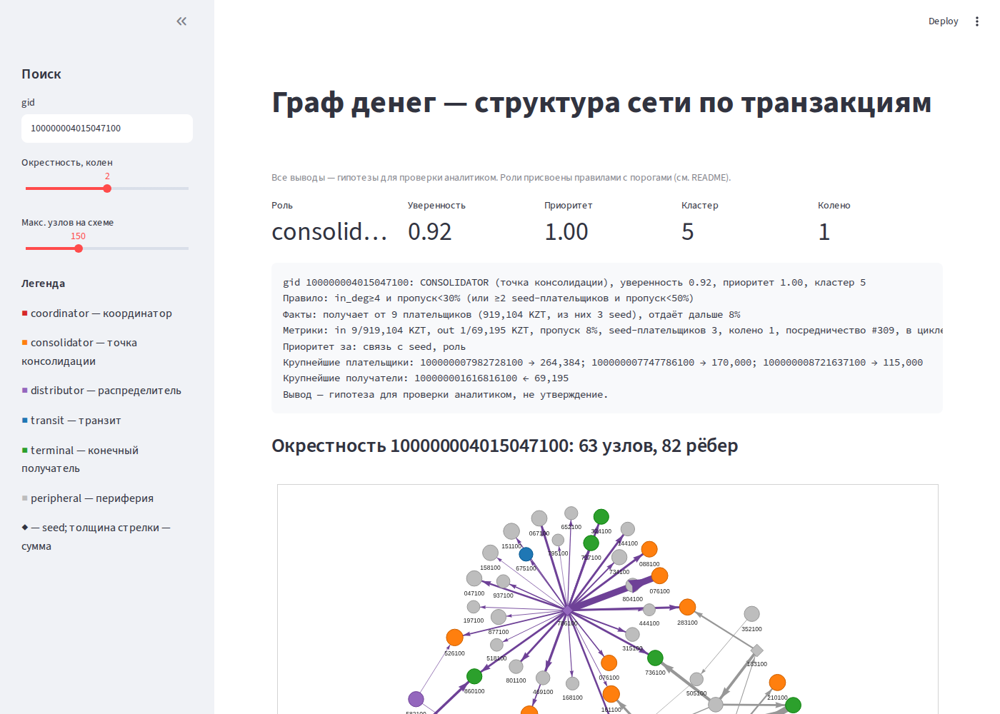

# Граф денег — восстановление структуры финансовой сети по транзакциям

Решение кейса Freedom (HackAlem AI). Инструмент для AML-аналитика: по 4-хоповому графу исходящих переводов от 81 seed-клиента присваивает каждому из 2 248 узлов **объяснимую роль**, разбивает сеть на кластеры и отвечает на вопрос **«кого смотреть первым и почему»**.

Все выводы — **гипотезы для проверки аналитиком**, а не утверждения о виновности.



## Запуск (одна команда)

```bash
pip install -r requirements.txt
python -m moneygraph run --data data --out output      # ≈ 4 с на ноутбуке → 3 CSV
```

Windows: `.\run.ps1 install`, затем `.\run.ps1 run`. Linux/macOS: `./run.sh run`.

Проверка и демо:

```bash
python -m moneygraph check --out output      # схема CSV: 2 248 строк, роли, evidence, ≥20 в топе
python -m moneygraph explain <gid>           # объяснение роли за минуту (для жюри)
python -m moneygraph ask "кто собирает деньги с <gid> <gid> ..."   # ассистент, см. ниже
python -m pytest -q tests                    # 4 теста must-have
streamlit run app/streamlit_app.py           # экран просмотра: поиск gid, схема, топ-лист, кластеры
```

Зависимости: pandas, pyarrow, networkx, numpy, streamlit, pyvis. Всё локально, без GPU и внешних API. Схема сети работает офлайн (vis.js встроен в HTML).

## Запуск без установки (офлайн, запасной вариант)

Если на ноутбуке для демо нет Python или интернета. Архивы содержат проект и свой Python 3.11 со всеми библиотеками ([python-build-standalone](https://github.com/astral-sh/python-build-standalone)); в систему ничего не ставится, работает с флешки.

| Платформа | Архив | Запуск |
|---|---|---|
| Windows x64 | `moneygraph-win-x64.zip` (≈150 МБ) | распаковать в короткий путь, например `C:\mg`, затем `run_offline.bat run` |
| Linux x64 | `moneygraph-linux-x64.tar.gz` (≈170 МБ) | `tar -xzf moneygraph-linux-x64.tar.gz && cd moneygraph && ./run_offline.sh run` |

Готовые архивы — в ветке [`offline-bundles`](https://github.com/BAITC-Hacks/hack-d4a071e9-mydream/tree/offline-bundles) (части по 25 МБ + `join_win.bat` / `join_linux.sh`). Скачать только её: `git clone --single-branch -b offline-bundles https://github.com/BAITC-Hacks/hack-d4a071e9-mydream`.

Команды те же для обоих: `run`, `explain <gid>`, `check`, `test`, `app` (Streamlit на http://localhost:8501). Вопрос Streamlit про e-mail при первом запуске отключён в `.streamlit/config.toml` (`server.showEmailPrompt = false`).

- Windows: распаковывать командой `tar -xf moneygraph-win-x64.zip -C C:\mg` (tar встроен в Windows 10/11): это быстрее «Извлечь всё» в Проводнике, и tar сообщает об ошибках. Проводник на ~18 тыс. файлов может молча остановиться, тогда Python падает с `No module named 'encodings'`.
- Windows: распаковывать в короткий путь. Самый длинный путь внутри архива — 158 символов, а лимит Windows — 260; глубокая папка в OneDrive может его превысить.
- Антивирус или SmartScreen может спросить разрешение для `python.exe` — это обычный CPython из python-build-standalone, не наш бинарь.
- Архивы в git не хранятся (`portable/`, `dist/` в `.gitignore`). Пересобрать на Linux с интернетом: `bash tools/build_portable.sh` (≈3 мин). Скрипт сам прогоняет пайплайн и тесты на Linux-сборке и проверяет полноту зависимостей Windows-сборки (`tools/check_win_deps.py`).

## Что на выходе

| Файл | Содержание |
|---|---|
| `output/nodes_roles.csv` | 2 248 строк: `gid, role, role_score, cluster_id, priority_score, evidence` + метрики |
| `output/clusters.csv` | 106 кластеров: размер, число seed, внутренний оборот, топ-5 gid, гипотеза |
| `output/top_nodes.csv` | 30 узлов по приоритету: `rank, gid, role, priority_score, why` |
| `output/features.parquet` | все метрики — для UI и `explain` |
| `output/bursts.csv` | признаки дробления: ≥3 перевода одной паре за день (93) и ≥4 плательщика одному получателю за день (29) |
| `output/resilience.csv` | устойчивость: доля потока от seed и крупнейшей связной части после удаления N узлов — по приоритету, по объёму, случайно |

Результат на выданных данных: coordinator 8, consolidator 50, distributor 50, transit 36, terminal 139, peripheral 1 965 (из них 444 обрезаны 4-м коленом, 19 seed без переводов в выборке). 8 кластеров содержат более одного seed.

## Как работает

```
parquet → метрики (граф + время) → кластеры (Louvain) → роли (правила) → приоритет → CSV → UI
```

1. **Метрики** (`features.py`). Из `edges`: степени, обороты, `pass_through = out/in`, PageRank и HITS по суммам, betweenness, компоненты, циклы ≤ 5, число seed-плательщиков, доля крупнейшего плательщика, средний чек. Из `transactions`: даты первого/последнего прихода и ухода, лаг, доля исходящей суммы, ушедшей ≤ 2 дней после прихода, активные дни, всплески переводов одной паре за день.
2. **Кластеры** (`clusters.py`). Louvain на ненаправленной проекции с весом `sum_kzt`, `seed=42` (детерминизм). Компоненты < 5 узлов — отдельный кластер целиком. Направление денег в кластеризации не участвует — оно учтено в ролях.
3. **Роли** (`roles.py`). Правила применяются сверху вниз, первое совпадение. Все пороги — в `moneygraph/config.py`.
4. **Приоритет** (`priority.py`). Взвешенная сумма процентильных рангов, штраф за обрезанные узлы и seed.

## Правила ролей и пороги

| Роль | Правило | Почему такой порог |
|---|---|---|
| **coordinator** | не seed; `in_deg ≥ 3` и `out_deg ≥ 3`; betweenness в топ-2 % среди ненулевых; связан с ≥ 2 кластерами | «между» несколькими группами и с потоком в обе стороны — кандидат в организаторы |
| **consolidator** | не seed; `in_deg ≥ 4` и (`pass_through < 30 %` или исходящих нет) — **или** ≥ 2 seed-плательщика и `pass_through < 50 %` | в данных 89 узлов с `in_deg ≥ 4`, из них 41 удерживает деньги; 24 узла получают напрямую от ≥ 2 seed |
| **distributor** | `out_deg ≥ 10` и `out_deg ≥ 3 × in_deg` (seed допускаются) | 64 узла с веерной рассылкой на 10+ получателей |
| **transit** | не seed; `70 % ≤ pass_through ≤ 130 %`; лаг ≥ 0; ≥ 50 % исходящего ушло ≤ 2 дней после прихода | 70 узлов с пропуском ≈ 1, из них 31 гонит деньги быстро — это и есть транзит |
| **terminal** | не seed; исходящих нет; колено < 4; `in_kzt ≥ 500 000` или `in_deg ≥ 2` | стоков на коленах 1–3 — 1 079 с медианой 46 тыс.; порог отсекает мелкие разовые переводы |
| **peripheral** | всё остальное | подтипы в evidence: обрезан 4-м коленом, seed без переводов, ниже порогов |

`role_score` — насколько узел превысил порог своего правила, 0–1 (peripheral = 0.2). `evidence` — числа из тех же метрик, ≤ 200 символов.

**Приоритет:** `0.30·rank(in_kzt) + 0.20·rank(in_deg) + 0.15·rank(betweenness) + 0.15·seed_src + 0.10·rank(pagerank) + 0.10·role_weight`; ×0.3 для обрезанных, ×0.5 для seed (они уже известны следствию); нормировка 0–1. В `why` указаны два вклада, по которым узел выделяется сильнее всего.

## Как учтены ловушки данных

| Ловушка | Решение |
|---|---|
| **444 узла обрезаны 4-м коленом** (`out_deg = 0` — артефакт обхода) | никогда не `terminal`; `peripheral` с evidence «обход остановлен, сток не подтверждён»; приоритет ×0.3. Тест `test_truncated_not_terminal` |
| **У seed занижены входящие** (граф собран от них) | `pass_through` для seed не используется; seed получает роль только по исходящим (`distributor`) либо `peripheral` с пояснением |
| **Только исходящие переводы** — у 302 из 671 проточных узлов деньги ушли раньше, чем пришли по данным | `lag_days < 0` блокирует `transit`; у coordinator высокий `pass_through` объясняется внешними источниками, а роль — посредничеством и связью кластеров |
| **Суммы ≠ количество** | evidence показывает и число плательщиков, и сумму, и средний чек |
| **19 seed без рёбер** | попадают в CSV как `peripheral`, evidence «переводы ≥ 5 000 KZT в выборке отсутствуют» |
| **16 компонент** | малые компоненты — отдельные кластеры с гипотезой «данных недостаточно» |

## Ограничения подхода

- Пороги подобраны по распределениям этой выгрузки; на другом банке/периоде их нужно перекалибровать (все в `config.py`).
- Нет ground truth — качество ролей оценивается обоснованностью правил, не accuracy.
- Louvain работает на ненаправленной проекции; направленную кластеризацию (потоковые сообщества) не делали.
- Дробление сумм ниже 5 000 KZT невидимо; входящие потоки извне выборки неизвестны — полный баланс узла не восстанавливается.
- Временные признаки основаны на датах без времени суток.

## Масштабирование до ~1 млн узлов

- networkx → igraph / graph-tool (или cuGraph на GPU); pandas → polars / DuckDB для агрегаций.
- Betweenness — approximate (k-sampling) или только на ядре графа; PageRank и Louvain масштабируются линейно.
- Расчёт по слабосвязным компонентам параллельно; инкрементальный пересчёт затронутых компонент при новой выгрузке.
- Хранение features в Parquet / ClickHouse; UI читает окрестность gid, а не весь граф (уже так).
- Пороги — по квантилям на всём графе при загрузке; правила не меняются.

## Структура репозитория

```
moneygraph/      пайплайн: load → features → clusters → roles → priority → export → extras; explain; assistant; cli
app/             streamlit_app.py — экран просмотра
tests/           test_outputs.py — must-have M2, M4, M5
data/            parquet от организаторов
output/          результат прогона
tools/           build_portable.sh — сборка офлайн-архивов; check_win_deps.py
starter/         стартовый код организаторов (не используется, оставлен для сравнения)
DESIGN.md        проектный документ: требования, архитектура, компромиссы, план
```

## Экран: вкладки

| Вкладка | Что показывает |
|---|---|
| Узел | карточка роли, `explain`, схема окрестности, входящие/исходящие, топ-лист, кластеры |
| Правила ролей | таблица правил и порогов, строится из `config.py`; число узлов и пример на каждую роль; формула приоритета |
| Дробление | эпизоды из `bursts.csv` с фильтром по типу |
| Устойчивость | графики из `resilience.csv`: топ-30 по приоритету оставляют 72 % потока от seed, топ-30 по объёму — 78 %, 30 случайных — 98 % |
| Ассистент | вопрос с gid → общие получатели и плательщики (код) → формулировка ответа (OpenAI) |
| Схема решения | данные → метрики → роли → кластеры → интерфейс, с числами из прогона |
| Демо | сценарий на 5 минут с реальными gid, чек-лист репетиции, ответы на вопросы жюри |

## Ассистент (OpenAI)

Кандидатов находит код: обход графа до 2 колен от заданных gid, общий получатель или плательщик — связан хотя бы с двумя из них. Модель OpenAI только пересказывает эти факты и роли не присваивает. Без ключа, без сети или при ошибке API ответ собирается по шаблону из тех же фактов, поэтому демо от сети не зависит; источник ответа подписан под ним.

- Ключ: переменная `OPENAI_API_KEY`, иначе файл `openai_key.txt` в корне проекта (лежит в репозитории для демо жюри; репозиторий приватный). После хакатона ключ отозвать и файл удалить.
- Модель: `ASSISTANT_MODEL` в `config.py` (`gpt-5-mini`), переопределяется переменной `OPENAI_MODEL`.
- Пример: на вкладке заготовлен вопрос про пятерых seed, которые платят seed `100000005382566100` — сам он по правилам остаётся peripheral (seed не бывает консолидатором), а ассистент показывает, что он собирает деньги со всех пятерых.

## Демо (5 минут)

Сценарий с конкретными gid и таймингом — на вкладке «Демо». Кратко:

1. Схема решения; живой прогон `run` — ≈4 с.
2. Топ-1 — консолидатор с 3 seed-плательщиками: схема окрестности, крупнейшие плательщики.
3. Координатор: связывает 10 кластеров, посредничество топ-5 — почему это не distributor.
4. Обрезанный узел с 4-го колена: почему он не terminal.
5. Дробление и устойчивость: топ-30 по приоритету отсекают 28 % потока от seed.
6. Ассистент: «кто собирает деньги с этих пятерых».
7. Жюри называет любой gid → вкладка «Узел» или `explain <gid>`.
