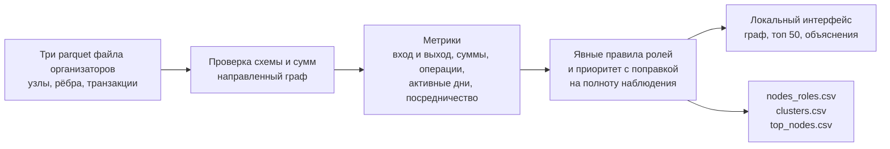

# Схема решения · Money Graph

```mermaid
flowchart LR
    A[Три parquet файла организаторов<br/>узлы, рёбра, транзакции] --> B[Проверка схемы и сумм<br/>направленный граф]
    B --> C[Метрики<br/>вход и выход, суммы, операции,<br/>активные дни, посредничество]
    C --> D[Явные правила ролей<br/>и приоритет с поправкой<br/>на полноту наблюдения]
    D --> E[Локальный интерфейс<br/>граф, топ 50, объяснения]
    D --> F[nodes_roles.csv<br/>clusters.csv<br/>top_nodes.csv]
```

Все исходные и выходные идентификаторы обезличены. Роли описывают гипотезы по наблюдаемым переводам, а не установленную причастность клиента.
