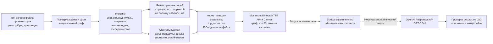

# Схема решения · Money Graph

Все исходные и выходные идентификаторы обезличены. Роли описывают гипотезы по наблюдаемым переводам, а не установленную причастность клиента.

Сплошной путь от Parquet до выгрузок и экрана выполняется локально без API-ключей. Необязательный помощник получает вопрос и ограниченный фрагмент графа; его ответ не меняет роли, кластеры или приоритеты. [Формулы и ограничения](README.md#проверяемый-метод), [сценарий демонстрации](PITCH.md).

